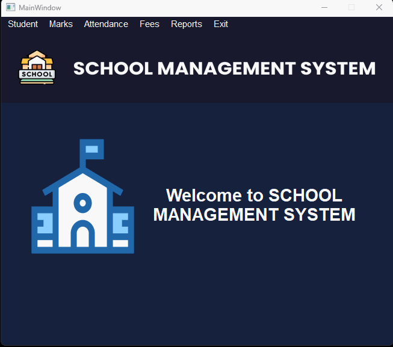
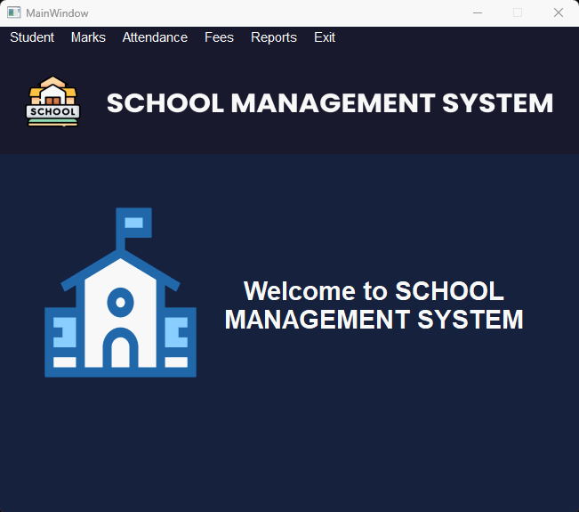
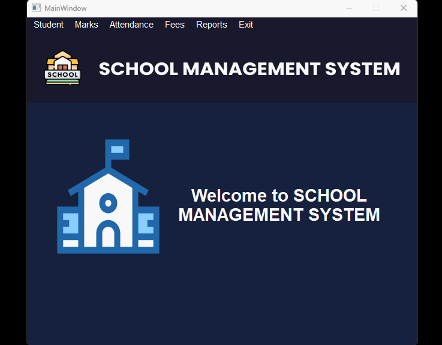

# School Management Software


This project is a CRUD school management system application that has been developed using Python, PyQt6, Qt Designer, and MySQL.


## Features

- Student registration with their personal details and academic information
- Attendance management for students
- Exam and result management
- Fee management for students
- Generate various reports such as student details, marks, attendance, and fee reports

## Prerequisites

- Python 3
- PyQt6
- Qt Designer
- MySQL

## Features Showcase

### Login Form

**Features:**

- Login with admin Credentials
- **Prompt** and **Message** for Invalid Credentials 
- Logout Functionality

|                            Login                             |                       Logout                       |
| :----------------------------------------------------------: | :------------------------------------------------: |
|  |  |

### Student Tab

**Features:**

- Add, Edit and Delete Student Details
- Auto-Increment Registration Number
- Calculate **Age** from **Date Of Birth**

| Add New Student                                         | Edit / Delete Student                                        |
| ------------------------------------------------------- | ------------------------------------------------------------ |
|  |  |

### Marks Tab

**Features:**

- Add, Edit and Delete Marks Details
- Fetch All Registration Number
- Fetch Marks For Specific Exams

| Add Marks                                             | Edit / Delete Marks                                          |
| ----------------------------------------------------- | ------------------------------------------------------------ |
|  |  |

### Attendance Tab

**Features:**

- Add, Edit and Delete Attendance Details
- Fetch All Registration Number
- Fetch Attendance Specific Date
- Set **Add Attendance** Tab Date to Current Date 

| Add Attendance                                             | Edit / Delete Attendance                                     |
| ---------------------------------------------------------- | ------------------------------------------------------------ |
|  |  |

### Fees Tab

**Features:**

- Add, Edit and Delete Fees Details
- Set **Add Fees** Tab Date to Current Date 
- Set **Add Fees** Tab Month to Current Month 
- Fetch Fees Details For Specific Receipt Number
- **Print Preview** and **Print** functionality for Printing the Fees Receipt

| Add Fees                                             | Edit / Delete Fees                                           |
| ---------------------------------------------------- | ------------------------------------------------------------ |
|  |  |

### Reports Tab

**Features**

- **Students Report**
- **Marks Report**
- **Attendance Report**
- **Fees Report**
- Organized view of all Administrative Reports In one place 

|                    View Reports                     |
| :-------------------------------------------------: |
|  |


## Installation

1. Clone the repository

​	`git clone https://github.com/ankitsamaddar/school_management_pyqt.git`

2. (**Optional**) Create a Python virtual environment and activate it

   ```bash
   python -m venv pyenv
   pyenv\Scripts\Activate
   ```

3. Install the required packages

  	`pip install -r requirements.txt`

4. Install `xampp` and copy the school_db to `C:\xampp\mysql\data\school_db`.

   ```bat
   winget install ApacheFriends.Xampp.8.2
   ```

   Copy the `school_db` or create a directory symbolic link.

   (Requires Elevated Command Prompt)

   ```bat
   mklink /d C:\xampp\mysql\data\school_db "C:\path\to\school_management_pyqt\schl_mgmt_app\school_db"
   ```


## Usage

1. From the **XAMPP Control Panel** start the **Apache** and **MySQL** server.
2. Navigate to the project directory and run the `main.py` file

  ```bat
  cd school_management_pyqt 
  python ./schl_mgmt_app/main.py
  ```

2. Use the software to manage Student Registration, Attendance, Exam and Result Management, Fee Management, and Generate Reports.

## License

This project is licensed under the MIT License - see the [LICENSE]() file for details.

## Acknowledgments

- This project was inspired by the need to have an efficient way to manage school records.
- Thanks to the developers of Python, PyQt6, Qt Designer, and Mysql for creating such amazing tools that made this project possible.
